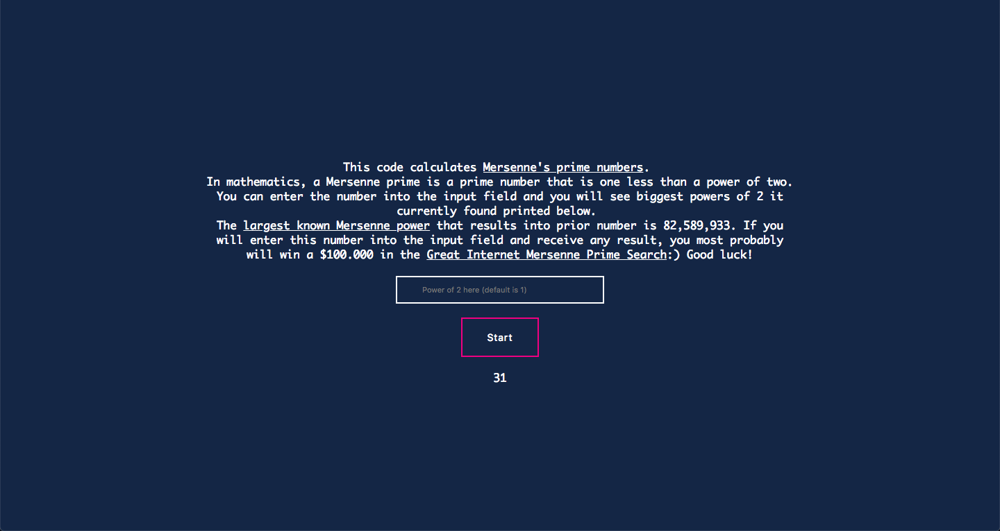

### Introduction

This repository contains a Flask-based Python application that calculate next bigger power of 2 which would result in prior number (known as [Mersenne's prime](https://en.wikipedia.org/wiki/Mersenne_prime)).
This repository is my home submission for Cloud Infrastructure Basics course at UCU (https://apps.ucu.edu.ua/data-science/).

### Tutorial

#### Docker

Build a container:

```
docker build -t uculut/lut-ucu-prior-numbers:latest .
```

Run a container:

```
docker run -d -p 5026:5026 uculut/lut-ucu-prior-numbers
```

Open localhost:5026 on your computer and click *Start* (optionally, you can enter a biggest power you want the algorithm to start calculations from).
Clicking *Stop* button will kill calculation process and make server idle (*Start* button will be available again). Results are rendered on the page requested once in 15 seconds.

#### Kubernetes

To deploy to kubernetes locally, you will need to start minikube first:

```
minikube start
```

In some cases there is a need to specify VM you are using, for example:

```
minikube --vm-driver=hyperkit start
```

Next, you will need to deploy to local kubernetes cluster:

```
kubectl create -f deployment.yaml
```

Wait a couple of minutes. You can validate status of your deploy using the command:

```
kubectl create -f deployment.yaml
```

Now you can validate your deployment using the following command:

```
kubectl get pods
```

Which will produce you the following output:

```
NAME                 READY     STATUS    RESTARTS   AGE
lut-mersenne-prime   1/1       Running   0          3m
```


Alternatively, you can use the ./deploy.sh script to install to minikube automatically


